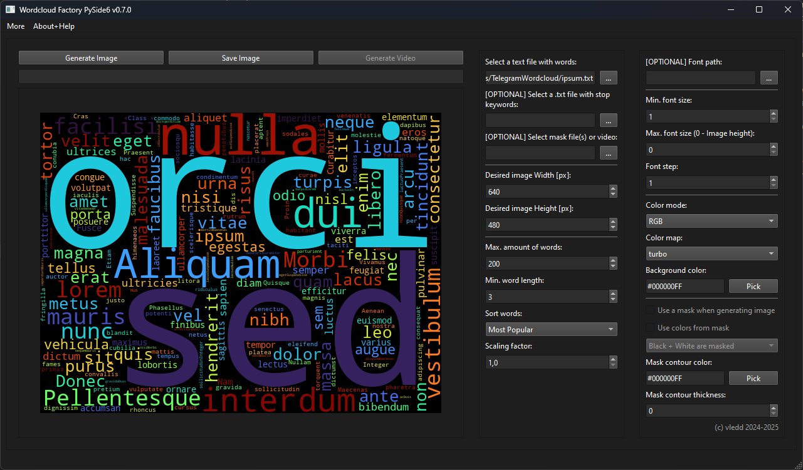

# Wordcloud Factory (ex. TelegramWordcloud)

Greetings and welcome to the repository of Wordcloud factory.
Hoping you will enjoy spending time with this little piece of software. 

**Software is still HEAVILY WIP. Expect not working buttons and crashes.
[Inform me if you see any!](https://github.com/vledd/Wordcloud-Factory/issues)**

# ❓ What is this and some history

Wordcloud Factory is an GUI-Based Application created for allowing me to experiment with Telegram chats with my friends.
Namely, creating funny Wordclouds, seeing how much cursing words we may find and also trying to build some lore out of 
random words combinations.

Firstly I used some code from GitHub by another developer, but I strongly disliked the UI/UX, it was painful to 
create something and experiment with.
**I have decided to write my own app from scratch, utilizing power of
[Wordcloud library by amüller](https://github.com/amueller/word_cloud). Check it out!** 

Now it is *almost* a mature app with vast playground available for your experiments.
As a main win here, I see the possibility to firstly generate as much preview images as you want, and only then save
those on your PC! This allows you to create a perfect Wordcloud without cluttering your disk.

After showing this app locally to my friends, it improved even more, and now you already can experiment even with
video creating! It is rough and operates only with separate frames, yet even this allows you to automate 80% of a
pipeline. 

*I **MAY** consider bundling or having syscalls to FFMPEG to automate even the final video production,
but let us save this feature for real geeks. If you are interested, consider
[opening an issue](https://github.com/vledd/Wordcloud-Factory/issues).*

# 🛠️ How 2 Install

**IMPORTANT:** Binary files are likely won't be included in Releases since I have no finances and will
to deal with signing just for some `Macrohard Attacker` would not mark it as a malware and delete it from your PC.

I will most probably still include them in next releases, yet I recommend to run this app from sources.
It is easier than you think! Guide is below.

## [NOT YET] 💾 Run from Releases Binary

When they would be ready, just go to `Releases`, download one for your platform, and you are good to go!
May be needed to suppress your Anti-Virus software. *Nothing I can do with it!*

## [RECOMMENDED] 🔨 Run from sources

- For every platform, please install **Python 3.10**.
I'm not sure how other versions will perform, not yet tested.
With 3.10 everything works smooth as possible, if you have some library installation errors, probably you should
try 3.10.
  **I will test newer Pythons when I will have some time.**

- Clone this repository using git or just by pressing `Code -> Download ZIP` in GitHub.

### 🪟 Macrohard Doors (Windows)

0. Open PowerShell as Administrator and run `Set-ExecutionPolicy -ExecutionPolicy RemoteSigned -Scope LocalMachine`.
Restart PowerShell. This is mandatory for having ability to create your Virtual Environment for Python.
1. Use PowerShell. Use `cd` command to go to the root folder (called `Wordcloud-Factory`).
    
    Example: `cd C:\Users\*the_user*\Desktop\Wordcloud-Factory`
2. Execute `python -m venv .venv` command to create Virtual environment. It would take some time.
3. Execute `.\venv\Scripts\activate` to activate venv. You should see `(venv)` in your command line now.
4. Execute `pip install -r requirements.txt` to install needed libraries.
5. Execute `python .\src\app.py` to run actual application.
6. Have fun.

### 🐧 Linux

You probably already know what to do, but:

1. `cd` to enter root directory of this project.
2. `python3 -m venv .venv` to create venv.
3. `source .venv/bin/activate` to activate venv. 
4. `pip install -r requirements.txt` to install requirements
5. `python src/app.py` to run application
6. Have fun.

### 🍎 Mac

Don't have one, should probably be 99% similar to Linux! Use zsh or what you have for Terminal. 
Don't forget to have fun, since this is a very important step!

# 🪛 How 2 Operate

[TODO]

**Later I will create a separate manual, no worries! But in general everything should be straightforward.**

1. Press `...` near `Select a text file with words` and select either exported JSON Telegram chat or Plain TXT.
2. At this point you can already press `Generate Image` as much as you want. If you like one, press `Save Image`
button.
3. Most of the settings are self-explanatory, give them a shot. *Font path is not yet functional :P*

- Stopwords .txt file works so-so. It should be a file with words you don't want to see, one word per line,
if I remember correctly, last line empty (maybe not). Will pay more attention to this feature later.
- **Mask files are a pure joy!** *[For now only JPG]*. Load one .jpg file, tick a `Use a mask when generating image`
checkbox, also try `Use colors from mask` (highly recommended) to get cool effects.

  Don't miss `Colors masked` Combo box below. It allows you to NOT put letters on particular color. 
  - `Black is masked` -> #000000 Pixels are masked. No letters are placed there.
  - `White is masked` -> No letters are placed on #FFFFFF pixels area.
  - `Black + White` -> No letters on #000000 AND #FFFFFF pixels.
  - `None` -> Letters are placed everywhere. **May be very resource-hungry!**

- If you select multiple masks, **you can generate video frames out of those!** 
  - Try extracting some video frames in JPG format using `ffmpeg` or online services and load it as mask.
  - Tune parameters, you can click on `Generate Image` to see how first frame will behave.
  - Click `Generate Video`, select save folder and hope for the best! This is Multiprocessor function, 
    so your PC may heat up a bit!
    Progress bar should help you track the execution and cute girls should brighten up the wait 😻! 

- **My personal recommendation**: 
  - Use at least `250-300 words` with combination of `Max. Font Size` around 50 to have tight and hi-res image.
    Bigger font size may look to chunky, yet you are the creator!

# 🔄️ Updates timeline

I am working at this project after 9-5 (😿), so multiple hiatuses and breaks are totally normal.
If you are willing to help me with fixing a bug or requesting a feature, please use
[issues](https://github.com/vledd/Wordcloud-Factory/issues). I would take a look and most probably fix/add something,
of course if it would be a good idea that will suit this app well.
